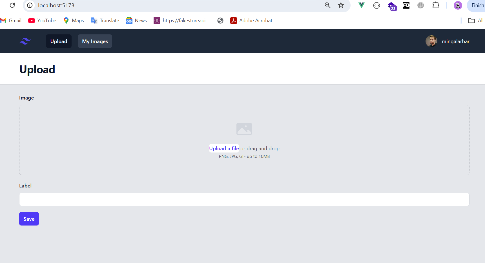
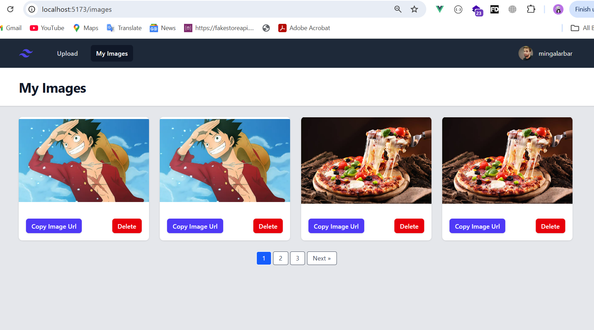
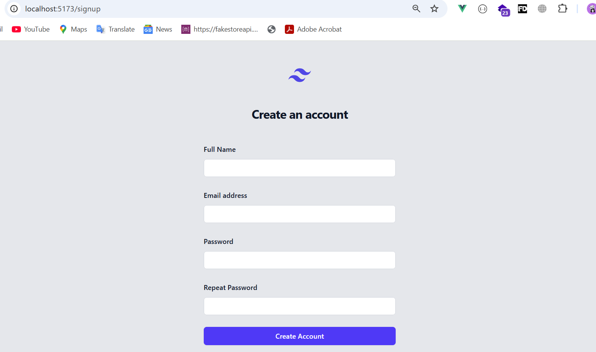

# Vue Frontend - Image Upload & Paginated Gallery with Laravel API

This is the frontend (Vue 3 + Vite) application for an image upload and gallery project, connected to a [Laravel Sanctum-authenticated API backend](https://github.com/MinKhantNaung/backend_laravel). The goal of this project is to help developers learn how to build and integrate a full-stack application using a Vue frontend and a Laravel API backend, with authentication, pagination, and route protection.

## 📸 Project Demo Screenshots

| Upload Page                                   | Paginated Gallery                              | Login/Register                                |
| --------------------------------------------- | ---------------------------------------------- | --------------------------------------------- |
|  |  |  |

## 🔥 Features

- 📦 Upload images to the Laravel backend
- 📸 Display paginated image gallery
- 🔐 Sanctum CSRF-based session authentication
- 🚫 Route protection: block guest users from accessing authenticated pages, and block authenticated users from login/register pages
- 📄 Vue pagination with Laravel paginated data structure

## 🧠 What You’ll Learn

- How to connect Vue to a Laravel backend with Sanctum authentication
- How to handle CSRF tokens and sessions with Laravel Sanctum
- How to protect routes in Vue using `vue-router` with auth/guest guards
- How to fetch and display paginated data from Laravel in a clean UI

## 📂 Backend Repository

Laravel backend repo: [backend_laravel_api](https://github.com/MinKhantNaung/backend_laravel)

> Be sure to clone and set up the backend before starting this frontend app.

---

## 🛠️ Project Setup

```bash
git clone https://github.com/MinKhantNaung/frontend_vue.git
```

```bash
cd frontend_vue_gallery
```

```bash
npm install
```

```bash
npm run dev
```
